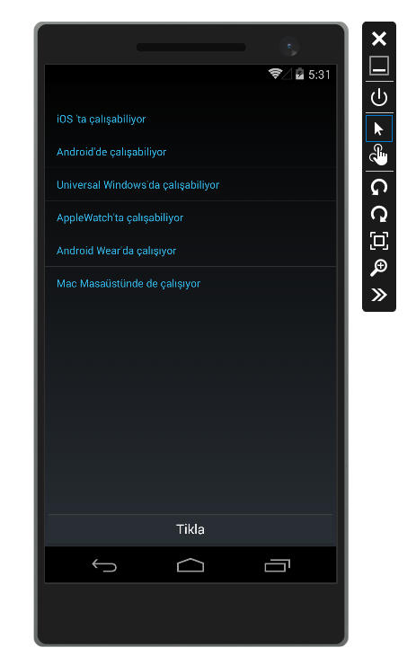
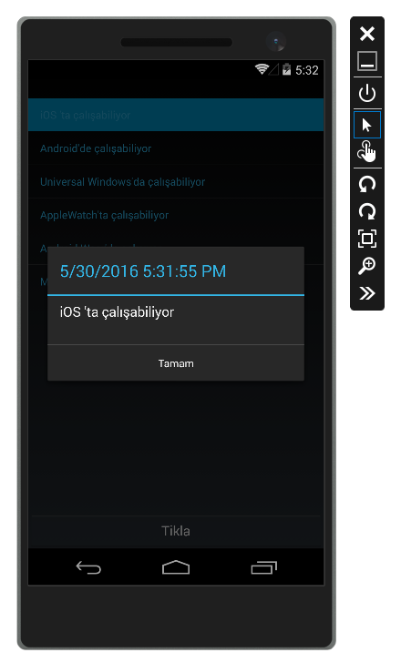
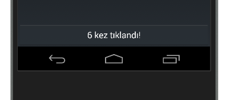
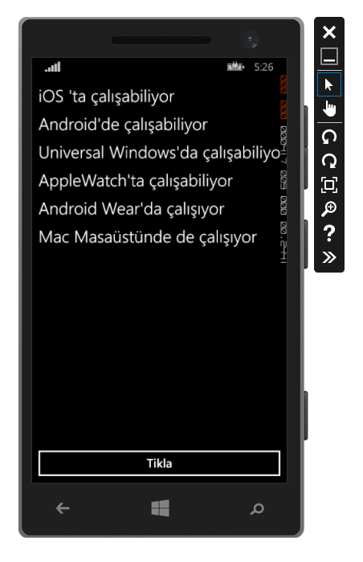
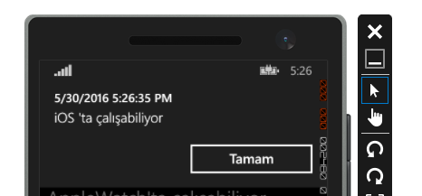

#Xamarin.Forms Portable Class Library Örneği

Bu örnekte Xamarin.Forms'un temel özelliklerini görüp inceleyebilirsiniz. 'XamarinFormsHelloPCL' Portable Class Library içerisine AnaSayfa.cs eklenerek içerisinde tüm projelerde ortak paylaşılmasını sağlayan tek bir arayüz kodunun tanımlanması ile Windows Phone, Android ve iOS platformlarında çalışabilmektedir. Bu arayüzlerin Android ve Windows platformlarındaki arayüzlerini aşağıdan inceleyebilirsiniz. Eğer Mac bir cihazı host olarak kullanırsanız da aynı kod iOS üzerinde çalışabilmektedir. 

##Android Mobil Arayüzü

> Xamarin Forms aracılığı ile mobil uygulama Android'de native arayüzle görünmesi. 

> Liste, Button ve notification'un arayüzü ilgili Android versiyonuna göre kendisini otomatik adapte etmektedir.

##Windows Phone Mobil Arayüzü

> Xamarin Forms aracılığı ile mobil uygulama Windows Phone'da native arayüzle görünmesi. 

> Liste, Button ve notification'un arayüzü Windows Phone'a kendisini otomatik adapte etmektedir.
